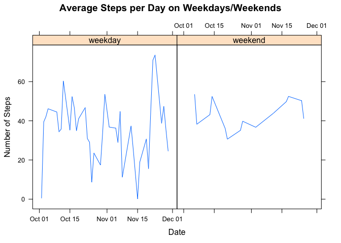

## Loading and preprocessing the data


```r
library(dplyr)
```

```
## 
## Attaching package: 'dplyr'
```

```
## The following objects are masked from 'package:stats':
## 
##     filter, lag
```

```
## The following objects are masked from 'package:base':
## 
##     intersect, setdiff, setequal, union
```

```r
activity <- read.csv("activity.csv")
```
## Total Number of Steps Taken Per Day


```r
total_daily_steps <- aggregate(data =activity, steps ~ date, FUN = sum, na.rm=TRUE)

hist(total_daily_steps$steps, main = "Steps per Day", xlab = "Steps", col = "orange")
```

<!-- -->


## What is mean total number of steps taken per day?

```r
print(paste("Mean Steps Overall: ",mean(total_daily_steps$steps, na.rm = TRUE)))
```

```
## [1] "Mean Steps Overall:  10766.1886792453"
```

```r
print(paste("Median Steps Overall: ", median(total_daily_steps$steps, na.rm = TRUE)))
```

```
## [1] "Median Steps Overall:  10765"
```

```r
mean_steps <- aggregate(data =activity, steps ~ date, FUN = mean, na.rm=TRUE)
hist(mean_steps$steps, main = "Average Steps per Day", col = "blue", xlab = "Number of Steps")
```

<!-- -->

```r
median_steps <-aggregate(data =activity, steps ~ date, FUN = median, na.rm=TRUE)
```


###Which 5-minute interval, on average across all the days in the dataset, contains the maximum number of steps?


```r
max_steps <- max(activity$steps, na.rm=TRUE)
activity[which(activity$steps == max_steps),]
```

```
##       steps       date interval
## 16492   806 2012-11-27      615
```

## Inputing missing values

### Number of missing values


```r
sum(is.na(activity$steps))
```

```
## [1] 2304
```


```r
full_activity <- activity[1:3]
full_activity[] <- lapply(full_activity, function(x) ifelse(is.na(x), mean(x, na.rm = TRUE), x))
```

### Total steps each day


```r
total_full_steps <- aggregate(data =full_activity, steps ~ date, FUN = sum, na.rm=TRUE)
hist(total_full_steps$steps, xlab = "Steps Each Day", main="Total Steps Each Day", col = "green")
```

<!-- -->
### Mean steps in revised data set


```r
aggregate(data =full_activity, steps ~ date, FUN = mean, na.rm=TRUE)
```

```
##    date      steps
## 1     1 37.3825996
## 2     2  0.4375000
## 3     3 39.4166667
## 4     4 42.0694444
## 5     5 46.1597222
## 6     6 53.5416667
## 7     7 38.2465278
## 8     8 37.3825996
## 9     9 44.4826389
## 10   10 34.3750000
## 11   11 35.7777778
## 12   12 60.3541667
## 13   13 43.1458333
## 14   14 52.4236111
## 15   15 35.2048611
## 16   16 52.3750000
## 17   17 46.7083333
## 18   18 34.9166667
## 19   19 41.0729167
## 20   20 36.0937500
## 21   21 30.6284722
## 22   22 46.7361111
## 23   23 30.9652778
## 24   24 29.0104167
## 25   25  8.6527778
## 26   26 23.5347222
## 27   27 35.1354167
## 28   28 39.7847222
## 29   29 17.4236111
## 30   30 34.0937500
## 31   31 53.5208333
## 32   32 37.3825996
## 33   33 36.8055556
## 34   34 36.7048611
## 35   35 37.3825996
## 36   36 36.2465278
## 37   37 28.9375000
## 38   38 44.7326389
## 39   39 11.1770833
## 40   40 37.3825996
## 41   41 37.3825996
## 42   42 43.7777778
## 43   43 37.3784722
## 44   44 25.4722222
## 45   45 37.3825996
## 46   46  0.1423611
## 47   47 18.8923611
## 48   48 49.7881944
## 49   49 52.4652778
## 50   50 30.6979167
## 51   51 15.5277778
## 52   52 44.3993056
## 53   53 70.9270833
## 54   54 73.5902778
## 55   55 50.2708333
## 56   56 41.0902778
## 57   57 38.7569444
## 58   58 47.3819444
## 59   59 35.3576389
## 60   60 24.4687500
## 61   61 37.3825996
```

### Median steps in revised data set


```r
aggregate(data =full_activity, steps ~ date, FUN = median, na.rm=TRUE)
```

```
##    date   steps
## 1     1 37.3826
## 2     2  0.0000
## 3     3  0.0000
## 4     4  0.0000
## 5     5  0.0000
## 6     6  0.0000
## 7     7  0.0000
## 8     8 37.3826
## 9     9  0.0000
## 10   10  0.0000
## 11   11  0.0000
## 12   12  0.0000
## 13   13  0.0000
## 14   14  0.0000
## 15   15  0.0000
## 16   16  0.0000
## 17   17  0.0000
## 18   18  0.0000
## 19   19  0.0000
## 20   20  0.0000
## 21   21  0.0000
## 22   22  0.0000
## 23   23  0.0000
## 24   24  0.0000
## 25   25  0.0000
## 26   26  0.0000
## 27   27  0.0000
## 28   28  0.0000
## 29   29  0.0000
## 30   30  0.0000
## 31   31  0.0000
## 32   32 37.3826
## 33   33  0.0000
## 34   34  0.0000
## 35   35 37.3826
## 36   36  0.0000
## 37   37  0.0000
## 38   38  0.0000
## 39   39  0.0000
## 40   40 37.3826
## 41   41 37.3826
## 42   42  0.0000
## 43   43  0.0000
## 44   44  0.0000
## 45   45 37.3826
## 46   46  0.0000
## 47   47  0.0000
## 48   48  0.0000
## 49   49  0.0000
## 50   50  0.0000
## 51   51  0.0000
## 52   52  0.0000
## 53   53  0.0000
## 54   54  0.0000
## 55   55  0.0000
## 56   56  0.0000
## 57   57  0.0000
## 58   58  0.0000
## 59   59  0.0000
## 60   60  0.0000
## 61   61 37.3826
```
###What is the impact of imputing missing data on the estimates of the total daily number of steps?
The mean and median values both increase.

## Are there differences in activity patterns between weekdays and weekends?


```r
library(lattice)

mean_steps$weekend <- ifelse(weekdays(as.Date(mean_steps$date)) %in% c("Saturday","Sunday"), "weekend", "weekday")

panel.smoother <- function(x, y) {
  panel.xyplot(x, y) # show points 
  panel.loess(x, y)  # show smoothed line 
}

with(mean_steps, {
  xyplot(steps ~as.Date(date, "%Y-%m-%d") |factor(weekend), 
         type = "l",
         xlab = "Date", ylab = "Number of Steps", 
         main = "Average Steps per Day on Weekdays/Weekends")    
})
```

<!-- -->
